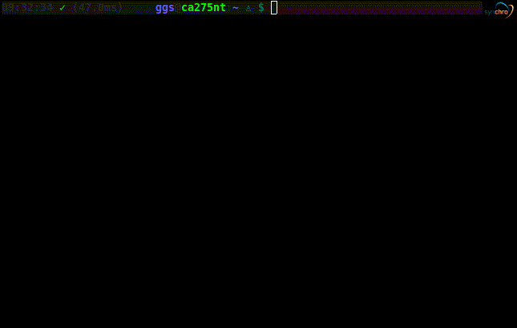

ton-PS1
=======

This is a shell script to configure the COMMAND_PROMPT and PS1 variable for bash.



How to use
==========
```bash
    source ton-ps1.sh
```

Issues
======
* when resizing need to use `reset` command

have fun.
Glaudiston
